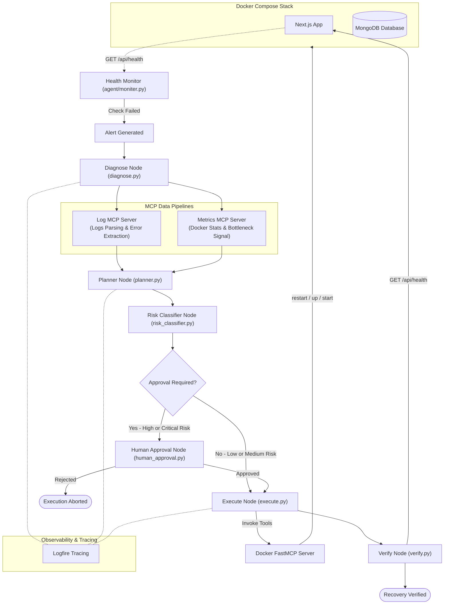

# 🛠️ Autonomous DevOps Agent

An intelligent, self-healing DevOps agent built with **LangGraph**, **FastMCP (Model Context Protocol)**, and **Groq (LLMs)**. The agent automatically monitors dockerized services, detects failures, analyzes logs and system metrics, formulates remediation plans, evaluates risk levels, executes recovery actions via Docker MCP tools, and verifies service recovery.

---

## 📐 Architecture & Workflow



---

## 🌟 Key Features

- 🔍 **Automated Incident Detection**: Continuously monitors the target service endpoints (e.g., `/api/health`) and triggers the agent on failure.
- 📋 **Log & Metrics Diagnosis**:
  - **Log MCP Server**: Fetches container logs, parses structured timestamps/severities, extracts tracebacks/error patterns, and generates an LLM root-cause analysis.
  - **Metrics MCP Server**: Inspects real-time `docker stats`, detecting CPU/Memory spikes, Block I/O bottlenecks, and container health issues.
- 🧠 **Smart Remediation Planning**:
  - **LLM Planning**: Leverages Groq models (`gpt-oss-120b`) to formulate multi-step Docker tool invocations.
  - **Rule-Based Short-Circuiting**: Automatically detects network-isolation faults (`docker network disconnect`) and executes `docker_compose_up` to restore missing network bindings.
- 🛡️ **Risk Classification & Human Approval**:
  - Classifies remediation risks (`LOW`, `MEDIUM`, `HIGH`, `CRITICAL`).
  - Implements a Human-in-the-Loop (HITL) gate for high-risk or destructive actions.
- 🐳 **FastMCP Server Integration**: Separates agent reasoning from environment tool execution. Executes actions securely through FastMCP Docker tools (`start_container`, `stop_container`, `restart_container`, `docker_compose_up`, `remove_container`).
- 🩺 **Automated Verification**: Retries service health checks post-execution to confirm full system recovery.
- 🔥 **Full Observability**: Integrated with **Logfire** for distributed tracing across agent nodes and MCP servers.
- 💥 **Chaos Engineering Suite**: Includes CLI scripts to inject faults (database kills, network isolation, memory leaks, disk fill).

---

## 📁 Repository Structure

```text
.
├── agent/
│   ├── graph.py               # Main LangGraph StateGraph pipeline definition
│   ├── moniter.py             # Health monitoring loop that triggers agent runs
│   ├── alert.py               # Alert schema and incident logging persistence
│   ├── state.py               # TypedDict defining AgentState across graph nodes
│   └── nodes/                 # Graph nodes
│       ├── diagnose.py        # Runs Log MCP & Metrics MCP pipelines + LLM diagnosis
│       ├── planner.py         # Generates remediation plan (rule-based + LLM)
│       ├── risk_classifier.py # Evaluates remediation risk and approval needs
│       ├── human_approval.py  # Terminal-based HITL approval gate
│       ├── execute.py         # MCP Client executing Docker tool calls
│       └── verify.py          # Post-remediation health check verification
├── mcp_server/
│   ├── docker.py              # FastMCP Docker tools server
│   ├── log_mcp/               # Log analysis MCP server & tool definitions
│   └── metrics_mcp/           # Metrics analysis MCP server & tool definitions
├── chaos/                     # Chaos engineering fault-injection scripts
│   ├── kill_db.py             # Kills MongoDB container
│   ├── network.py             # Disconnects target container from Docker network
│   ├── memory_leak.py         # Simulates memory leak scenario
│   └── disk_full.py           # Simulates disk full scenario
├── e-com/                     # Sample E-Commerce Next.js application
├── data/                      # Incident logs and persisted alert history
├── docker-compose.yml         # Compose configuration for Next.js App + MongoDB
├── config.py                  # API Keys & Configuration loader
└── requirements.txt           # Python dependencies
```

---

## 🚀 Getting Started

### Prerequisites

- **Python 3.10+**
- **Docker & Docker Compose**
- **Groq API Key** (for LLM reasoning)
- **Logfire Token** (optional, for tracing)

### 1. Installation

Clone the repository and install the dependencies:

```bash
git clone https://github.com/Mohit776/DevOps-Agent.git
cd DevOps-Agent

# Set up virtual environment
python -m venv .venv
source .venv/bin/activate  # On Windows: .venv\Scripts\activate

# Install requirements
pip install -r requirements.txt
```

### 2. Environment Setup

Create a `.env` file in the root directory:

```env
GROQ_API_KEY=your_groq_api_key_here
GROQ_FALLBACK_API_KEY=your_groq_fallback_api_key_here
GEMINI_KEY=your_gemini_key_here
LOGFIRE_TOKEN=your_logfire_token_here
```

### 3. Start the Demo Application

Launch the Next.js and MongoDB services using Docker Compose:

```bash
docker compose up -d --build
```

Verify that the application is running at `http://localhost:3000`.

---

## 💡 Usage & Demonstration

### 1. Start the Health Monitor & Agent

Run the health monitor in a terminal window:

```bash
python agent/moniter.py
```

The monitor pings `http://localhost:3000/api/health` every 5 seconds.

### 2. Inject Chaos (Simulate an Incident)

In a separate terminal, trigger one of the chaos scripts:

#### Scenario A: Kill Database Container
```bash
python chaos/kill_db.py
```
*The database container is stopped. The monitor detects a failure, the agent diagnoses the missing DB connection, executes `docker_compose_up` or `start_container`, and verifies recovery.*

#### Scenario B: Network Isolation Chaos
```bash
python chaos/network.py --service app
```
*The app container is disconnected from its Docker networks. The planner detects network isolation via rule-based rules and executes `docker compose up -d --force-recreate` to restore network attachments.*

---

## 🛠️ Built With

- [LangGraph](https://github.com/langchain-ai/langgraph) - Stateful Agent Workflow Orchestration
- [FastMCP](https://github.com/jlowin/fastmcp) - Model Context Protocol SDK
- [Groq](https://groq.com/) - High-Speed LLM Inference API
- [Logfire](https://logfire.pydantic.dev/) - Unifying Tracing & Observability
- [Docker Engine & Compose](https://www.docker.com/) - Containerization Infrastructure